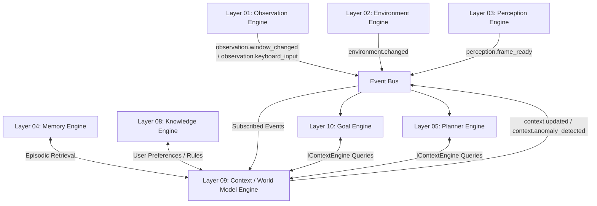

# Layer 09 — Context / World Model Engine Specification

## 1. Purpose

The Context / World Model Engine maintains the current real-time cognitive understanding of the user's active environment (situational awareness). It serves as a unified, reactive in-memory context frame, synthesizing low-level perception, system environment, and execution tracking signals into semantic world states for higher cognitive reasoning and goal planning layers.

---

## 2. Subsystem Boundaries & Ownership



### 2.1. Responsibilities
* **Unified State Fusion**: Synthesize inputs from Observation (active window, user idle status), Environment (CPU, memory, battery), and Perception (OCR text, visual layout classifications) into a single, cohesive in-memory `WorldState`.
* **Activity & Intent Tracking**: Monitor user input presence to classify whether the user is active, idle, or if the runtime is currently executing a plan.
* **Working Memory Maintenance**: Manage a sliding window of recent state history (e.g., last 10 frames) to allow higher layers to track short-term environmental trends.
* **Anomaly & Safety Monitoring**: Detect and emit warning events upon finding critical safety, environment, or process anomalies (e.g., sudden low battery, process hang, network failure).
* **Context Provisioning**: Provide fast, thread-safe public APIs for the Planner (Layer 05) and Goal Engine (Layer 10) to query the active environment.

### 2.2. Non-responsibilities
* **Action Execution**: Layer 09 must never execute shell commands, write files, or interact with providers.
* **Plan Generation**: Layer 09 must never plan tasks or schedule dependencies.
* **Durable Storage**: Layer 09 must never directly persist data to SQLite or files. It is strictly an in-memory state engine.
* **Direct Hardware Observation**: Layer 09 must never call OS APIs directly. It relies entirely on Event Bus payloads from Layer 01–03.

---

## 3. Data Model

The core data structures are defined as immutable Python dataclasses:

### 3.1. ActiveWindowContext
Represents details of the currently focused window:
* `title`: `str` (the title bar text)
* `process_name`: `str` (the executable name)
* `bounds`: `Dict[str, int]` (x, y, width, height)
* `is_minimized`: `bool`

### 3.2. HostEnvironmentSummary
Represents host system resource indicators:
* `cpu_usage_percent`: `float`
* `available_memory_mb`: `float`
* `network_status`: `str` ("connected", "disconnected")
* `power_source`: `str` ("battery", "AC")
* `battery_percent`: `float`

### 3.3. TaskStateContext
Tracks execution context from lower engines:
* `active_plan_id`: `Optional[str]`
* `active_step_id`: `Optional[str]`
* `executor_status`: `str` ("idle", "planning", "executing", "verifying")

### 3.4. WorldState (ContextFrame)
The compiled representation of the environment:
* `state_id`: `str` (UUID)
* `timestamp`: `str` (ISO-8601 string)
* `active_window`: `ActiveWindowContext`
* `running_applications`: `List[Dict[str, Any]]` (list of active process names)
* `clipboard_summary`: `Optional[str]` (redacted clipboard content)
* `host_environment`: `HostEnvironmentSummary`
* `task_state`: `TaskStateContext`
* `perceived_user_activity`: `str` ("active", "idle", "system_executing")
* `detected_anomalies`: `List[str]` (anomalous conditions if any)

---

## 4. Published & Subscribed Events

### 4.1. Subscriptions
* `observation.window_changed`: Focused window change triggers immediate context updates.
* `perception.frame_ready`: Recovers OCR layout classification and screen content.
* `environment.changed`: Host environmental system alerts or application changes.
* `observation.keyboard_input` & `observation.mouse_moved` / `observation.mouse_button`: Updates user activity timers.
* `planning.plan_started` & `planning.plan_completed` & `planning.plan_aborted`: Synchronizes active cognitive status.
* `execution.step_started` & `execution.step_completed` & `execution.step_failed`: Feeds state tracking.

### 4.2. Publications
* `context.updated`: Fired when a new `WorldState` is compiled and ready. Payload contains the serialized `WorldState` dictionary.
* `context.anomaly_detected`: Fired when a safety anomaly (low battery, process lock, network disconnection) is discovered.

---

## 5. Public Interfaces

```python
from abc import ABC, abstractmethod
from typing import Any, Dict, List, Optional
from override.runtime.interfaces.engine import ICognitiveEngine

class IContextEngine(ICognitiveEngine):
    """
    Versioned public interface for the Layer 09 Context / World Model Engine.
    Maintains the runtime cognitive understanding of the user's active environment,
    active window, running applications, clipboard, system states, and perceived intent.
    """

    @abstractmethod
    async def get_current_state(self) -> Dict[str, Any]:
        """
        Retrieves the unified current state of the world model (context frame).
        
        Returns:
            A dictionary representing the compiled WorldState / ContextFrame.
        """
        pass

    @abstractmethod
    async def get_active_window(self) -> Dict[str, Any]:
        """
        Retrieves the details of the currently focused active window.
        
        Returns:
            A dictionary containing window metadata (title, process name, boundaries).
        """
        pass

    @abstractmethod
    async def get_running_applications(self) -> List[Dict[str, Any]]:
        """
        Retrieves the list of currently running applications.
        
        Returns:
            A list of dictionary summaries of active processes.
        """
        pass

    @abstractmethod
    async def get_clipboard_context(self) -> Optional[str]:
        """
        Retrieves the current parsed/redacted content of the clipboard.
        
        Returns:
            A string containing the clipboard contents, or None.
        """
        pass

    @abstractmethod
    async def get_host_environment_summary(self) -> Dict[str, Any]:
        """
        Retrieves the summary of host environment resources.
        
        Returns:
            A dictionary of host system metrics (CPU, Memory, Disk, Network, Battery).
        """
        pass
```

---

## 6. Performance & Security Requirements

### 6.1. Performance
* **Fusing Latency**: Transitioning event inputs and compiling a new `WorldState` must take **< 50ms**.
* **Query Latency**: API lookups (e.g. `get_current_state()`) must resolve in **< 5ms** by reading from thread-safe in-memory cache states.
* **Memory Safety**: Keep a sliding window of only the last **10** `WorldState` frames. Older frames must be released immediately to prevent memory overhead (> 20MB).

### 6.2. Security
* **PII Redaction**: All compiled clipboard content or window titles containing passwords, SSNs, credit cards, or API keys must be redacted before being shared in `context.updated` payloads.
* **Data Isolation**: The in-memory working states must never be written to temp files. Any long-term storage requirements must delegate to Layer 04/08.

---

## 7. Acceptance Criteria

A successful implementation of Layer 09 must pass these tests:
1. **Topological Integration**: Verify `ContextEngine` successfully registers in bootstrap DI containers and registers dependencies on Layer 03 (Perception) and Layer 04 (Memory).
2. **State Synthesis Check**: Submitting a mock `perception.frame_ready` and `environment.changed` event correctly compiles a unified `WorldState` carrying matching values.
3. **Redaction Check**: Confirming that sensitive data in raw inputs or clipboard payloads is successfully redacted from published `context.updated` events.
4. **Interface Retrieval**: Confirming that querying methods (`get_current_state`, etc.) return valid dictionary mappings within 5ms.
5. **Memory Cap Test**: Simulating 1,000 successive environment state updates under test must not trigger memory growth beyond 25MB (sliding frame cap verified).
6. **Graceful Shutdown**: The engine cleanly unsubscribes from the Event Bus and releases all state handles on shutdown.
