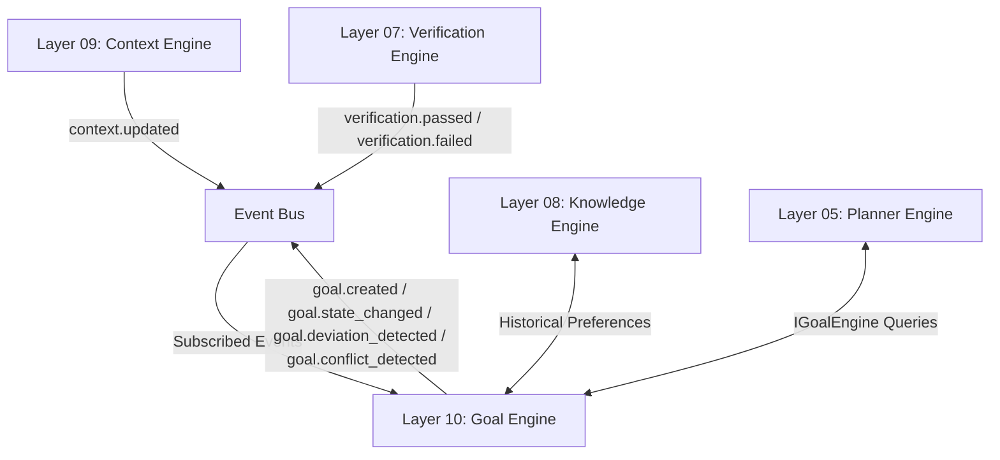
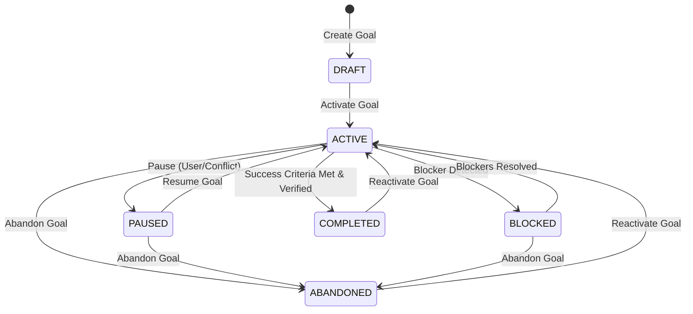

# Layer 10 — Goal Engine Specification

## 1. Purpose

The Goal Engine (Layer 10) represents, structures, and tracks the user's objectives over time. It maintains a hierarchical goal tree, coordinates lifecycle state transitions, detects alignment deviations based on current context, and exposes active goals to the Planner (Layer 05) to align runtime execution plans with long-term user objectives.

---

## 2. Subsystem Boundaries & Ownership



### 2.1. Responsibilities
* **Objective Representation**: Maintain structured representations of user objectives (titles, descriptions, target dates, priorities, success criteria).
* **Hierarchical Organization**: Coordinate child/sub-goals under parent objectives with structural rollup properties.
* **Goal Lifecycle Management**: Manage state transitions for goals (Draft, Active, Paused, Blocked, Completed, Abandoned).
* **Dynamic Prioritization & Conflict Resolution**: Identify goal priority levels and resolve scheduling resource or logical constraints by prioritizing higher-rank goals.
* **Progress Tracking**: Aggregate verification results to calculate success criteria matching and adjust goal completion percentages.
* **Deviation Detection**: Track active windows and user activity against active goal constraints to detect distraction or misalignment.
* **Interface Provisioning**: Expose thread-safe query APIs for the Planner to pull active goal contexts during plan formulation.

### 2.2. Non-responsibilities
* **Action Execution**: Layer 10 must never execute command steps, spawn processes, or touch OS file handlers.
* **Outcome Verification**: Layer 10 does not perform verification directly. It subscribes to verification result events published by Layer 07.
* **Direct OS/Hardware APIs**: It does not observe mouse clicks or display buffers; context inputs are retrieved purely from Layer 09.
* **Long-Term Database Persistence**: Layer 10 does not own SQL or file persistence. It manages runtime state and issues transactional events; durable goal storage is handled by Layer 04/08 subscribing to goal status changes.

---

## 3. Data Models

```python
from dataclasses import dataclass, field
from datetime import datetime
from typing import List, Dict, Any, Optional

@dataclass(frozen=True)
@dataclass
class GoalNode:
    """Represents a single node in the Goal Hierarchy Tree."""
    goal_id: str
    title: str
    description: str
    parent_goal_id: Optional[str] = None
    priority: int = 3  # Scale from 1 (Lowest) to 5 (Highest)
    state: str = "DRAFT"  # DRAFT, ACTIVE, PAUSED, BLOCKED, COMPLETED, ABANDONED
    progress_percent: float = 0.0  # Range: 0.0 - 100.0
    created_at: datetime = field(default_factory=datetime.utcnow)
    updated_at: datetime = field(default_factory=datetime.utcnow)
    completed_at: Optional[datetime] = None
    target_date: Optional[datetime] = None
    blockers: List[str] = field(default_factory=list)
    criteria: List[str] = field(default_factory=list)  # Set of success conditions
    tags: List[str] = field(default_factory=list)  # Conflict tagging (e.g. "requires_focus")
```

---

## 4. Goal State Machine

Goals transition dynamically between states based on lifecycle triggers.



### State Definitions
* **DRAFT**: Created but inactive. The Planner ignores goals in this state.
* **ACTIVE**: In progress. The Planner schedules execution tasks to satisfy this goal.
* **PAUSED**: Temporarily suspended. Can be resumed.
* **BLOCKED**: Halted by an unresolved dependency (e.g. missing package, network outage).
* **COMPLETED**: Success criteria are verified as 100% satisfied. Terminal state unless reactivated.
* **ABANDONED**: Discarded by the user. Terminal state unless reactivated.

---

## 5. Event Contracts

### 5.1. Subscribed Events
* `context.updated`: Provides user focus, active window, and activity state to evaluate goal deviation.
* `verification.passed` & `verification.failed`: Provides test/outcome verification facts to evaluate goal progress.
* `planning.plan_started` & `planning.plan_completed` & `planning.plan_aborted`: Provides step progress to map active plans to goal nodes.
* `behavior.habit_detected`: Receives habit/routine detections to suggest new recurring goals.

### 5.2. Published Events
* `goal.created`: Fired when a new goal is registered.
* `goal.state_changed`: Fired when a goal transitions to a new lifecycle state.
  * Payload: `{"goal_id": str, "old_state": str, "new_state": str, "reason": str}`
* `goal.progress_updated`: Fired when progress is recorded.
  * Payload: `{"goal_id": str, "progress_percent": float, "delta": float}`
* `goal.deviation_detected`: Fired when the active context contradicts constraints of active goals.
  * Payload: `{"goal_id": str, "deviation_type": str, "details": str, "severity": str}`
* `goal.conflict_detected`: Fired when two active goals share conflicting tags or resource constraints.
  * Payload: `{"goal_id_1": str, "goal_id_2": str, "conflict_tag": str}`

---

## 6. Public Interfaces

```python
from abc import ABC, abstractmethod
from typing import Any, Dict, List, Optional
from override.runtime.interfaces.engine import ICognitiveEngine

class IGoalEngine(ICognitiveEngine):
    """
    Public query and command interface for Layer 10 Goal Engine.
    Tracks goals, progress rollups, priority conflicts, and deviations.
    """

    @abstractmethod
    async def create_goal(
        self,
        title: str,
        description: str,
        parent_goal_id: Optional[str] = None,
        priority: int = 3,
        target_date: Optional[str] = None,
        criteria: Optional[List[str]] = None,
        tags: Optional[List[str]] = None
    ) -> Dict[str, Any]:
        """
        Creates a new goal node in the hierarchy.
        """
        pass

    @abstractmethod
    async def update_goal_state(
        self,
        goal_id: str,
        state: str,
        reason: Optional[str] = None
    ) -> Dict[str, Any]:
        """
        Transitions the lifecycle state of a goal.
        """
        pass

    @abstractmethod
    async def get_goal(self, goal_id: str) -> Optional[Dict[str, Any]]:
        """
        Retrieves a goal's detail map by ID.
        """
        pass

    @abstractmethod
    async def get_goal_hierarchy(self) -> List[Dict[str, Any]]:
        """
        Returns the tree representation of all goals.
        """
        pass

    @abstractmethod
    async def get_active_goals(self) -> List[Dict[str, Any]]:
        """
        Retrieves all goals currently in the ACTIVE state.
        """
        pass

    @abstractmethod
    async def record_progress(
        self,
        goal_id: str,
        progress_percent: float,
        update_description: Optional[str] = None
    ) -> Dict[str, Any]:
        """
        Records progress percentage update for a specific goal.
        """
        pass
```

---

## 7. Subsystem Integration Mechanics

### 7.1. Planner Integration
When the Planner (Layer 05) initiates plan generation, it queries `IGoalEngine.get_active_goals()` to align sub-tasks with active objectives. Upon starting execution, `planning.plan_started` links the runtime plan to the matching goal node ID.

### 7.2. Context Integration
The Goal Engine processes `context.updated` events. It checks:
1. If the user is currently `"idle"` or `"active"`.
2. If `active_window.process_name` or `clipboard_summary` violates constraints of any active goal tagged with `"requires_focus"`.
3. If a mismatch persists beyond a threshold (e.g. 15 minutes of non-goal activity), it publishes `goal.deviation_detected`.

### 7.3. Knowledge Integration
Upon initializing, the Goal Engine requests baseline user preferences and historical goal criteria from `IKnowledgeEngine`. When goals transition to `COMPLETED`, the event `goal.state_changed` triggers Layer 08 to update task pattern metrics and save success templates.

---

## 8. Security Constraints

* **Hierarchy Mutex Validation**: Goal registrations and deletions must be verified. No untrusted modules can delete safety goals (e.g., "enforce firewall isolation") or suppress active monitoring.
* **Context Leak Isolation**: Payload data for `goal.deviation_detected` must be stripped of any raw clipboard or private window title contents. It must only contain semantic labels (e.g. "distracting_media_usage") to prevent memory leaks or PII leaks to the event log.

---

## 9. Performance Requirements

* **Query Time**: `get_active_goals()` and `get_goal()` must execute in **< 2ms** (in-memory lock lookup).
* **Rollup Computation**: Re-calculating nested child goal progress and completing parent rollups must execute in **< 10ms**.
* **Event Dispatch Overhead**: Evaluation of context updates against goal constraints must resolve in **< 15ms** to avoid blocking the event loop.

---

## 10. Testing Strategy & Acceptance Criteria

To declare Layer 10 design and future implementation verified, the system must pass these test categories:

1. **State Transition Tests**:
   * Assert all valid transitions (e.g., ACTIVE -> PAUSED).
   * Verify that invalid transitions (e.g., DRAFT -> COMPLETED) raise `ValueError`.
2. **Progress Rollup Tests**:
   * Configure a Parent goal with three Children (Weight: 1/3 each).
   * Update Child 1 progress to 100%. Assert Parent progress changes to 33.3%.
   * Complete all children. Assert Parent automatically transitions to `COMPLETED`.
3. **Prioritization & Mutex Conflict Tests**:
   * Register Goal A (Priority 5, tag: `ide_focus`) and Goal B (Priority 2, tag: `ide_focus`).
   * Activate both. Verify Goal A becomes `ACTIVE` and Goal B is transitioned to `PAUSED` with a conflict reason tag.
4. **Deviation Alarm Tests**:
   * Mock a `context.updated` containing focused process `"YouTube"` with active goal `"Write Code"`.
   * Fast-forward threshold and assert `goal.deviation_detected` is published.
5. **Teardown Cleanliness**:
   * Verify that stopping the Goal Engine fully empties the in-memory tree nodes and cancels all pending deviation watchdog timers.
